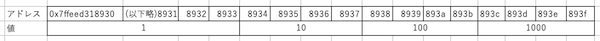

# 文字列

## C言語に文字列はない

さて、メモリとポインタの話を終えて、C言語とC言語が扱っている
機械としてのコンピュータの説明はほぼ終わった。

> 「途中、だいぶ振り落とされそうになりましたが、
> なんとかここまではついてこられました・・・」

ご苦労さん。でもなかなか面白かっただろう？

さてここまで、C言語のデータ型や構文、制御構造やライブラリなど
普通のC言語の本で書いてあるようなことは
ほぼやっていない。それらは他の言語をやっていればそんなに難しくないと思う。
特に、JavaのようなCに似せた構文の言語を勉強しているならなおさらだ。
興味があれば、適当な本を買ってもいいし、
ネットの解説記事を読んでもすぐに理解できるだろう。

ただし、もう1つだけ他の言語とまったく違う概念を持つ
言語仕様について説明しておく必要がある。
非常に重要な言語仕様で、日常的に良く使う必須の機能だが、
C言語の初心者、特にこれまで説明したメモリとポインタの話を
理解できていないプログラマが
決して触ってはいけないものなんだ。それは・・・

>「ゴクリ・・・」

文字列だ。

>「へ？文字列型？いわゆるStringですか？」

そうだ。その文字列だ。

>「やだなあ、プログラムの本は"Hello, World"からはじまるのが習わしですよ。
> 文字列が使えなかったら最初の1ページから挫折ですよ」

うん。"Hello, World"は文字列リテラルだから、初心者も使ってもいい。
リテラルを使っているだけなら安全だ。
でも、文字列はヤバい。

> 「え？その2つって違うんですか？というか文字列型が使えなかったら
>いったいどんなプログラムを書くんですか。何にも出来ないですよ」

文字列型が使えなかったら、プログラムは書けない？

>「ええ、書けません。だって、どんな計算をしても、
>出力できなきゃ何もしてないのと同じです。過程ではなく結果が大事なのです！」

残念なお知らせだ。C言語には文字列型は、ない。

>「プログラム書けないじゃないですか・・・」

文字列型がないというのは、特に重要なC言語の特徴だと思う。
C言語には文字型はあるが、文字列型はない。
まあ、文字型といっても実体は文字コードを格納するための整数型なんだけども、
C言語が「この整数型は文字コードを入れるためのものだ」としている型はある。
文字列は、この文字型の配列として表現する。

>「じゃあ、文字列はあるじゃないですか」

いや、文字の配列と文字列は違うものだろ。

Javaはその2つの間を変換できるようになっているけど、
でも、Char型の配列とString型は全然違うものだよね。

>「うーん・・・、そう言われればそうですけど、ピンとこないです」

## 配列

さて、C言語では文字列を処理するために文字の配列を使う。では、C言語において配列とはなんだろうか。

> 「えっ？同じ型のデータの集合じゃないんですか？」

概念的にはそんな感じでいいと思うんだけど、なにせ今扱っているのはC言語だ。データを扱うのなら、メモリマップ上でどうなっているのかがはっきりしないといけない。では、配列を使うとメモリの上ではどうなっているんだろうか。

例えば、32bitの整数の配列を作ったとしよう。そして、そのポインタを表示してみよう。そのためのコードは下のようになる。ちなみに`&(ary[0])`は配列aryの先頭のアドレスという意味だ。これは`&ary[0]`と書いてもいい。`(&ary)[0]`ではなく`&(ary[0])`と解釈される。でも、わかりやすさをとってわざと括弧をつけておいた。

```c
int ary[] = {1, 10, 100, 1000};

printf("address of ary[0]: %p\n", &(ary[0]));
printf("value of ary[0]: %d\n", ary[0]);

printf("address of ary[3]: %p\n", &(ary[3]));
printf("value of ary[3]: %d\n", ary[3]);
```

実行結果はこんな感じだとしよう。いつものように、アドレスは実行環境に依るし、実行のたびに違うかもしれない。

```
address of ary[0]: 0x7ffeed318930
value of ary[0]: 1
address of ary[3]: 0x7ffeed31893c
value of ary[3]: 1000
```

つまり、メモリ上はこういう感じになっていると考えられる。めんどくさいので値は16進数ではなく、10進数で書いた。



32bitなので1バイトのマスを4つ分使うことになる。要素は4つなので、計16個のマスが使われるわけだ。

> 「違和感ないです。当たり前のように思えます。」

さて、この配列にはaryという名前がついていて、ary[0]のようにインデックスを付けると中身が取り出せるんだけど・・・物理的にaryという変数には何が入っているんだろうか。見てみよう。

```c
int ary[] = {1, 10, 100, 1000};

printf("address of ary[0]: %p\n", &(ary[0]));
printf("value of ary[0]: %d\n", ary[0]);

printf("inside of ary:%p\n", ary); // <= 追加
```

実行結果は、こうなる。ary[0]のアドレスと、aryの中身はおんなじものだ。つまり、aryの中にはary[0]のアドレスが入っている。つまり、aryは配列の先頭を指しているポインタだ。

```
address of ary[0]: 0x7ffeed318930
value of ary[0]: 1
address of ary[3]: 0x7ffeed31893c
value of ary[3]: 1000
inside of ary: 0x7ffeed318930
```

だから、`*ary`とすると値が取り出せる。

```c
int ary[] = {1, 10, 100, 1000};

printf("value of *ary: %d\n", *ary);
```

それどころか、ポインタへの加減算も出来る。

```c
int ary[] = {1, 10, 100, 1000};

printf("address of ary[3]: %p\n", &(ary[3]));
printf("value of ary[3]: %d\n", ary[3]);

printf("inside of ary+3:%p\n", ary + 3);
printf("value of *(ary+3): %d\n", *(ary + 3));
```

実行結果

```
address of ary[3]: 0x7ffeed318930
value of ary[3]: 1000
inside of ary+3:0x7ffeed31893c
value of *(ary+3): 1000
```

ここで重要なことは、aryが0x7ffeed318930だとして、 **ary+3はx7ffeed318933じゃなくて** 0x7ffeed31893cだということだ。つまり、ポインタに1足すということは、その型のサイズ分ポインタが移動するということだ。

> 「えっ、えっ？ちょっと待ってください。どういうこと？というか、なんでそんなややこしいことを？」

さっきのメモリマップで考えてみよう。


intのポインタ`ptr`がアドレス0x7ffeed318930を指しているとする。そのとき、`ptr+1`が指しているのは0x7ffeed318933ではなくて、0x7ffeed318934だ。だって、`*(ptr+1)`がintだとしたら、すくなくとも0x7ffeed318933を指していたらおかしなことになるだろう？

>「考えさせて下さい・・・そうですね。0x7ffeed318933から4バイトを読んで整数として解釈したいって事はまずないでしょうね。なるほど、データの先頭へ必ず飛ぶようにする方が親切なのか・・・」

というか、要するに`ary[3]`と`*(ary+3)`は同じ意味だ。書き方が違うだけだ。`ary[3]`の方がわかりやすいから、同じ意味で別の書き方が用意されているだけだと思って良い。

>「おお？・・・つまり、C言語では配列って特別なものはなくて、要するにポインタを使ってメモリ上のデータを読んでいるだけってことなんですね」

大まかに言えばそういうことだ。ただし、C言語にも配列という概念はあって、ポインタと配列には大きな違いがある。それは、配列を宣言したらメモリが確保されるということだ。逆に言えば、大きさが決まらないと配列は宣言できない。

だから、Cで許される配列の宣言は、下のどちらかだ。

```c
//長さが10のintの配列。メモリが40バイト確保される。
int ary1[10];

//長さが4のintの配列。メモリが16バイト確保される
int ary2[] = {1, 2, 3, 4};
```

最近のC言語の仕様では`ary3[n]`のように長さを変数にすることも出来る。でも、少なくとも実行時には長さは確定しなければいけない。なぜならそのタイミングで具体的にメモリを確保する必要があるからだ。後から長さを増やすことはできない。なぜなら、増やそうと思ってもそのすぐ後ろのメモリ領域はもう何かに使っちゃってるかもしれないし、別なメモリ領域に続きを確保することもできない。だってポインタを足して、つまりずらしてデータの位置を決めて読み出しているんだから、絶対に連続してないと困るわけだ。

逆に、ポインタはいつでも宣言し放題だ。ただし、ポインタが指している位置のメモリが確保されているか、何が入っているかは自己責任だ。そこが「ポインタは危ない」といわれる所以だね。

## 番兵法とヌル終端文字列

さて、C言語の配列は結局、データが保持されているメモリ領域の先頭のポインタを持っているだけだった。ここまではいいよね？

>「理解しました。シンプルですね。ちょっとビックリはしましたけど、こんなもんで大丈夫なものなんですね」

そう。C言語の配列はもの凄くシンプルだ。そして、それゆえしばしば大丈夫じゃない。だって、配列の先頭のアドレスがわかっても、終わりのアドレスがわからないから、配列の長さがわからない。

>「んん？んんんん・・・？そう・・・なりますかね。つまり・・・？」

例えば、Javaだと、配列の要素をひとつずつ取り出したいとき、以下の様に書ける。

```java
int ary[] = {1, 2, 3, 4, 5};

for(i = 0; i < ary.length; i++){
    System.println(ary[i]);
}
```

C言語では、`length`に当たるものがないので、上と同じコードは書けないんだ。

>「えー」

ちなみに、syzeof演算子というものはある。`sizeof 式`の形と`sizeof(型)`の形があって、こうやって使う。

```c
int ary1[] = {1, 10};
int ary2[] = {1, 10, 100, 1000};

// sizeof 式 で、式のバイト数が求められる
printf("size of ary1: %zu\n", sizeof ary1);
printf("size of ary2: %zu\n", sizeof ary2);

// sizeof(型) で、型のバイト数が求められる
printf("size of int: %zu\n", sizeof(int));

// 割り算をすると要素数が出せる
printf("length of ary1: %zu\n", sizeof ary1 / sizeof(int));
printf("length of ary2: %zu\n", sizeof ary2 / sizeof(int));
```

実行結果

```
size of ary1: 8
size of ary2: 16
size of int: 4
length of ary1: 2
length of ary2: 4
```

> 「あ、ちゃんと要素数が出せてるじゃないですか。なあんだ、ちょっとJavaより一手間かかっているけど、要素数は出せるんですね」

と思って安心すると酷いバグを生むことになる。sizeof演算子は要注意だ。以下のプログラムをよく見て欲しい。実行結果はどうなるだろうか。

```c
int main(int argc, char **argv)
{
  int ary1[] = {1, 10};
  int ary2[] = {1, 10, 100, 1000};

  f(ary1, ary2);
}

void f(int ary1[], int ary2[])
{
  // sizeof 式 で、式のバイト数が求められる
  printf("size of ary1: %zu\n", sizeof ary1);
  printf("size of ary2: %zu\n", sizeof ary2);

  // sizeof(型) で、型のバイト数が求められる
  printf("size of int: %zu\n", sizeof(int));

  // 割り算をすると要素数が出せる
  printf("length of ary1: %zu\n", sizeof ary1 / sizeof(int));
  printf("length of ary2: %zu\n", sizeof ary2 / sizeof(int));
}
```

>「えっと、さっきのコードが2つの関数に分離されただけですよね？main関数で配列を作って、f関数でsizeofしていると。さっきと同じ結果になると思います。ならなかったら、コンパイラのバグでしょう！」

わざわざ聞くぐらいだから、もちろん同じ結果にはならないよ。

```
size of ary1: 8
size of ary2: 8
size of int: 4
length of ary1: 2
length of ary2: 2
```

>「うそーん・・・」

もちろんコンパイラのバグではない。まあ、しょっちゅう疑われるからだろう。手元のコンパイラは金切り声で警告を出している。

```
ch5_2.c:18:40: warning: sizeof on array function parameter will return size of
      'int *' instead of 'int []' [-Wsizeof-array-argument]
  printf("size of ary1: %zu\n", sizeof ary1);
                                       ^
```

直訳すると「警告: 配列の関数パラメータにおけるsizeofは、'int[]'ではなく'int *'のサイズを返します」と書いてある。何か間違ったことをしてしまっていることはすぐ気がつくだろう。

つまり、こういうことだ。

関数の定義に

```
void f(int ary1[], int ary2[])
```

と書いた場合、実際には

```
void f(int *ary1, int *ary2)
```

と処理される。つまり、関数fにはポインタが渡っていて、それが実際に配列の先頭アドレスかどうかはもうわからないということなんだ。

つまり、配列を宣言してメモリを確保して、その配列の名前が使えるところでは、処理系は配列の大きさをまだ覚えている。自分で確保したわけだからね。しかし、それがいったん関数呼び出しなどによって別な名前に引き継がれるときには、先頭アドレスの情報しか伝わらない。つまり、ポインタとして渡されることになる。いったんそうなってしまうと、それが配列の先頭アドレスだとしても、一体、要素数はいくつなのかはわからなくなってしまう。

そこで、関数に配列を渡して処理して欲しいときは、何らかの方法で配列の終わりの位置を教えてやらなければいけない。

>「何らかの方法って？」

一番簡単なのは、長さも一緒に渡してやることだ。

```
int main(int argc, char **argv)
{
  int ary[] = {1, 10, 100, 1000};

  f(sizeof ary / sizeof(int), ary);
}

void f(int size, int ary[])
{
  for (int i = 0; i < size; i++)
  {
    printf("%d\n", ary[i]);
  }
}
```

のようにする。そうすれば、問題なくfor文が書けるよね。

あるいは、番兵法という方法がある。番兵というのはあり得ないデータのことだ。番兵をデータの最後に入れて、それがきたらデータの末尾だと判定させるのが番兵法。例えば、このintの配列には正のデータしか来ないとする。その場合にあらかじめデータの最後のマークとして-1を入れておくことにする。

```
int main(int argc, char **argv)
{
  int ary[] = {1, 10, 100, 1000, -1};

  f(ary);
}

void f(int ary[])
{
  for (int i = 0; ary[i] >= 0; i++)
  {
    printf("%d\n", ary[i]);
  }
}
```

すると関数fの引数が1つ減らせる。が、データが4つしかないのに配列には5つ分のデータが必要になるし、符号なし整数で扱えるデータだったのに符号付き整数が必要になったりする。ここはトレードオフだ。

>「ふむふむ。やってることは理解できました。でも、自分でやるのなら要素数も一緒に渡す方がわかりやすいですかね。というか、配列の変数の中に要素数も一緒にいれて、セットで渡せるようにすればいいのに」

それはもっともな意見だし、たぶんJavaはそう実装されてるんだと思うよ。ただし、例えば要素数を保持するために32bitの整数を使うとすれば、空の配列のためにも余計に4バイトが必要になる。これはたぶん現代のコンピューティング環境のほとんどでは問題にならないデータサイズだから、ほとんどのモダンな言語の配列は要素数を自分で保持しているはずだ。ただし、C言語はその4バイトも惜しいというような非常にミニマムな環境や要素数が32bitでは収まらないというような巨大なデータを扱う環境でも使われることが期待されている。なので、配列のサイズをどう管理するかもプログラマにお任せだ。

ということで、C言語の配列の説明はおしまい。文字列の話に戻る。

>「あ、そうだった。文字列の話でした。C言語の文字列は文字の配列。配列は本質的にはただポインタ、でしたね」

そう。そして、C言語の配列はサイズの管理を自分でやる。つまり、文字列は文字型のポインタ。文字列の長さは番兵法で管理する。

>「おっと、そっちを使うんですか」

そうだ。文字型というのは、文字コードを格納する整数だ。そして、ASCIIコード表を確認して欲しいが、数字の0に文字は割り当てられていない。そこで、文字の配列で最後に0がきたら、そこで文字列はおしまい、と言うことになっている。

>「そんなに一気に言われてもわからないです」

OK。例で説明しよう。

```c
char str[] = "Hello";

printf("length of %s: %zu", str, sizeof str / sizeof(char));
```

さあ、実行結果はどうなる？

>「えーっと、"Hello"は5文字だから、str[]の長さは5・・・じゃないとは思います」

設問の意図だけ理解してるな。その通り。実行結果はこうなる。

```
length of Hello: 6
```

>「ふむふむ。5文字と最後に番兵ですな」

そういうこと。つまり、このプログラムはこう書き換えても同じだ。
全く同じ結果を返す。

```c
char str[] = {72, 101, 108, 108, 111, 0};

printf("length of %s: %zu", str, sizeof str / sizeof(char));
```

>「あ、ホントに0が入ってるんだ」

文字のリテラルもある。シングルクォートで囲むと文字列ではなく、文字になる。こう書き換えることも出来る。

```c
char str[] = {'H', 'e', 'l', 'l', 'o', '\0'};
```

`'\0'`が、数字の0を示す特殊文字だ。これをヌル文字と呼ぶ。そして、最後にヌルを置くことで終わりの位置を表現する文字列の表現方法をヌル終端文字列と呼ぶ。C言語では文字の配列でヌル終端文字列を扱うことによって文字列処理をするんだ。

というわけでC言語では文字列処理はとてもめんどくさい。

たとえば、2つのintの配列を繋げる処理を書きたいとする。素直に書くとこんな感じになるだろう。

```c
int ary1[] = {1, 2, 3};
int ary2[] = {4, 5, 6};

unsigned long size1 = sizeof ary1 / sizeof(int);
unsigned long size2 = sizeof ary2 / sizeof(int);

int concat_ary[size1 + size2];

int c = 0;
for (int i = 0; i < size1; i++)
{
  concat_ary[c] = ary1[i];
  c++;
}

for (int i = 0; i < size2; i++)
{
  concat_ary[c] = ary2[i];
  c++;
}

for (int i = 0; i < size1 + size2; i++)
{
  printf("%d\n", concat_ary[i]);
}
```

実行結果

```
1
2
3
4
5
6
```

特に不思議はないと思う。ところが、文字の配列で同じ事をするとき、考えることが増える。

```c
char str1[] = "abc";
char str2[] = "def";

unsigned long size1 = sizeof str1 / sizeof(char);
unsigned long size2 = sizeof str2 / sizeof(char);

char concat_str[size1 + size2];

int c = 0;
for (int i = 0; i < size1; i++)
{
  concat_str[c] = str1[i];
  c++;
}
for (int i = 0; i < size2; i++)
{
  concat_str[c] = str2[i];
  c++;
}

// 結合した文字列"abcdef"を期待している
printf("concat str = %s\n", concat_str);

for (int i = 0; i < size1 + size2; i++)
{
  printf("%d\n", concat_str[i]);
}
```

実行結果

```
concat str = abc
97
98
99
0
100
101
102
0
```

配列はきちんと連結されているが、途中にヌル文字が来てしまっているので、文字列として表示仕様とすると"abc"しか表示されない。

おかしいなと思って適当にググって、文字列の長さはstrlen()という関数を使うという単体の知識だけをゲットして、sizeofのところをstrlen()に置き換えてみたりするとさらなる悲劇が訪れる。

```c
char str1[] = "abc";
char str2[] = "def";

//ここを変更した
unsigned long size1 = strlen(str1);
unsigned long size2 = strlen(str2);

char concat_str[size1 + size2];

int c = 0;
for (int i = 0; i < size1; i++)
{
  concat_str[c] = str1[i];
  c++;
}
for (int i = 0; i < size2; i++)
{
  concat_str[c] = str2[i];
  c++;
}

printf("concat str = %s\n", concat_str);

for (int i = 0; i < size1 + size2; i++)
{
  printf("%d\n", concat_str[i]);
}
```

実行結果

```
concat str = abcdef
97
98
99
100
101
102
```

一見、ちゃんと動いているように見えるところが恐ろしい・・・

>「えーっと・・・そもそも"abcdef"という文字列のためには、配列はヌル文字の分もあわせて7文字必要なのに、concat_strは6文字分しかないですよね。最後にヌル文字書き込んでないし・・・。なんで正しく"abcdef"が表示されるんですか？」

そりゃ、たまたま`concat_str+6`のアドレスのメモリの値が0だったからでしょ。こうやって動いたり動かなかったりするデバックの面倒くさーいバグが簡単に作られてしまうのがC言語の文字列処理なんだよ。

あ、C言語で文字列の連結をするためにstrcat()という関数が用意されているんだけど、この関数も**あらかじめ結合した後の文字列をヌル文字も考慮して保持するのに十分な文字の配列を確保して引数に渡さなきゃいけない**ので、自分でヌル文字の考慮をしなきゃいけないことは変わらない。

つまり、C言語の文字列は文字の配列、つまりポインタ操作だけで実現されているので凄くシンプルだ。だから、わかっている人が使うと凄くムダがなく、効率的で、高速なコードを書くことが出来る。けど、うっかりバグを作ってしまう落とし穴が無数に空いている。地面より穴の方が面積が広いぐらいだ。十分に注意してもらいたい。が、仕組みとしては面白いなと思って貰えるんじゃないかと思うし、もっともシンプルな文字列のデータ構造として、プログラマならヌル終端文字列はぜひ知っておいて欲しいところだ。


