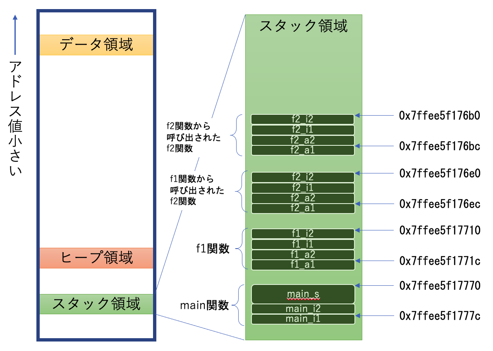

# スタックとヒープ

## malloc

>「前回、文字列は文字の配列で、配列は後から追加出来ないって言ってましたよね？」 

言ったね。それで？

>「困りますよね？」

うーん・・・まあ、困るかな。

>「例えば、テキストエディタを作るとするじゃないですか。ファイルから文字列を読み込みますよね。
> でも、大きいファイルも小さいファイルもあるわけだから、その文字列を読み込む配列を
> あらかじめ作っておくことはできませんよね？」

できないね。

うん。今までの話をちゃんと理解していれば、当然出てくる疑問だ。

本題に入る前に、言っておこう。テキストエディタは読み込んだファイルを
大きな1つの文字列に保存するわけではない。
そんなことしたら、途中の文字を削除したときに、
末尾の文字まで延々ひとつずつずらすことに
なりかねない。
配列はメモリ上に連続して入ってなければならないからね。
いろいろなやり方があると思うけど、
素朴なやりかたとしては、
各行ごとの文字列を作って、それをリストにする方法が考えられる。

ここでいうリストというのは、日常的に使う用語としてのリストではなく、
データ構造の名前としてのリストだ。
リストにもいくつかの種類がある。
例えば、JavaのAPIにはjava.util.ArrayListとjava.util.LinkedListがある。
どちらもリストという名前だけど、種類が違うので用途によって使い分けるべきだ。
何にも考えずにArrayListを使ってる人も多そうだけど、
実は単に「リスト」と呼んだときにデータ構造を学んだプログラマの頭に思い浮かぶものに
近いのはLinkedListだったりする。

> 「・・・そもそもLinkedListの存在を知りませんでした」

まあ、そういう人は一定数いると思う。

今回はデータ構造の説明はしないけど、アルゴリズムとデータ構造は
コンピューターサイエンスの基礎の基礎だ。
プログラムはプログラミング言語を習得すれば書けるようになると
誤解している人が多いし、プログラミング言語を習得する中で
並行してアルゴリズムも学んでいくことも多いと思う。
だけど、ある程度、プログラムを書くことに慣れたら、
ぜひ、アルゴリズムとデータ構造の本にチャレンジしてみて欲しい。
そして、そういう基礎を学ぶときにここまで語ってきた
「機械としてのコンピュータの世界」の知識はきっと役に立つはずだ。

さて、それはともかくだ。
プログラムを作っていたら、実行時にしかサイズが分からない配列を作りたいことはある。
つまり、動的にサイズが決まる配列だ。
もちろん、C言語でも動的にサイズが決まる配列を作ることが出来る。

・・・というか、必要なだけのメモリを取得することが出来る。
そのメモリ領域を配列だと考えてアクセスするのはプログラマの自由だ。
メモリを取得するには、mallocを使う。

> 「まろっく？」

読み方までは知らないな。決まっているのかな？
Memory を ALLOCate するんだから、「えむあろっく」かも？

さて、使い方はこんな感じだ。

```c
int *ary = malloc(sizeof(int) * 1000)
```

こうすると、intのサイズの1000個分のメモリ領域が確保されて、
その先頭のアドレスが返ってくる。
以前説明したとおり、配列の記法`ary[i]`は`&(ary + i)`とまったく同じモノなので、
aryを配列だと思ってプログラムを書いてまったく問題ない。

ただし、3つ注意点がある。

まず、mallocは空いたメモリを見つけてそこを確保してくれるが、
そのメモリ上に何が書いてあるかは気にしない。
必要があれば、そこを全部0で埋めるなどの初期化が必要になる。
つまり、上の例で言えば、いきなり`ary[555]`を読むことができるけど、
何が返ってくるかは分からない。
間違っても0が書いてあることを前提としたコードを書いてはいけない。
初期化の方法は割愛する。普通のC言語の教科書を見て欲しい(笑)。

2つ目は領域外へのアクセスだ。先頭アドレスが入ったポインタは貰えるが、
サイズは自分で指定したんだから、自分で別途管理すること。
確保した領域外を読んだり書いたりすると不幸が起きる。
配列を関数の引数で渡したときと似た話だね。

最後に、mallocで確保した領域は、要らなくなったら明示的に解放しなければならない。
解放はfree関数にポインタを渡せば良い。
mallocした領域をfreeし忘れるというのは、典型的なバグだ。
そうすると何が起きるかというと、プログラムを動かしている間に使っているメモリ量が
どんどん増えていく一方になる。
いわゆる「メモリリーク」で、最終的にはシステムのメモリを食い潰してしまう可能性がある。

こんなところかな。

## なぜローカル変数はFreeしなくてもよいのか

> 「つまり、プログラムを書いているときに『ここでメモリが使いたい。データを取っておきたい』と思ったら変数を宣言すればそこにデータを入れられるだけのメモリが確保される。でも、もう動かしている時に『書いていた時にはどれだけ必要かわからなかったけど、今はわかったからそれだけメモリが欲しい』となるなら、そのときに必要な量をmallocするようなプログラムを書いておけということ・・・？」

それであってるよ。

>「どちらにせよ、書いてるときに決めておくしかないんですね」

まあ、それがプログラムというものだね。プログラムが動きながら自分自身を書き換えていくようなことをしない限り。まあ、そんな怪しいことは今は考えない方が良い。

>「ちなみに、『メモリをください』というのが私の書いたプログラムだとして、メモリをくれるのは誰ですか？」

オペレーティングシステム(OS)だ。OSがメモリーを管理している。

>「でも、OSもプログラムですよね？OSは誰からメモリを貰うんですか？」

誰からも。OSにとってハードウェアに積まれているメモリは全部自分のものだ。
誰に断ることもなく、勝手にどのアドレスでも使っていい。
もちろん、現代のCPUやコンピューターには
ハードウェアにメモリ管理のための仕組みがあるので、
OSはメモリ管理にそれを使って楽をする。
以前にインテルのCPUのプロテクトモードの話をしたよね。
そういうものを使うんだったら、その仕組みに従う必要はある。

だけども、非常にプリミティブなコンピュータを考えれば、
OSは勝手にどこでもつかっていいし、
逆に言えばどこを使っているかは自分で管理しなきゃいけない。
さらに、OSの管理下で動いているどのプログラムに
どのメモリメモリを貸し出しているか
全部コントロールしなきゃいけない。OSさんは大変なお仕事だ。

>「感謝ですね!」

もちろん、OSごとにメモリを要求する命令は違うかもしれない。
しかし、C言語でmallocと書けば、コンパイルしたプログラムでは
各OSごとのメモリ要求命令に変換される。
メモリという実体はそのまま扱っているけど、メモリ要求という手続きは抽象化して、
プログラムの移植性を高めているんだね。
これがもっと高級な言語なら、確保したメモリのポインタとサイズという
メモリの実体そのものじゃなくて、
例えば「オブジェクト」のようなもっと抽象的なものが貰える。
このあたりがC言語っぽさが良く出ているところだ。

>「なんとなくC言語っぽいレベル感がわかってきました」

そして、OSにとって、概してmallocは面倒な処理だ。
まず、空いているメモリを探さなきゃいけない。
見つけたらそこを使用済みとして管理台帳に載せなければならない。
細切れの使用済み領域がたくさん出来たら新しいメモリ要求に応えられないかも知れないから、
ときどき区画整理をしないといけないかも知れない。
そして、それを全てのプログラム相手にやらなければならない。

なので、ここは工夫のしどころだ。
例えば、OSはあらかじめ使いそうな量を確保しておいたほうが良いかもしれない。
コンパイラが複数回のmallocを裏でまとめて一回で済むようなプログラムに
最適化してするべきかもしれない。
プログラマの方で大きめに要求して自分で小さくちぎって使うように気を遣ってるなんて、
優しいプログラマもいるだろう。
とにかく、巨大なメモリ要求や、少量ずつの大量のメモリ要求を処理するのは大変なので、
みんなが頑張ってる。

なので、現代の最適化されたコンピュータとOSの世界では、
mallocしたら裏でいろんなことが起きている可能性が高い。
でも、まあ、C言語でプログラムを書く立場としての理想は、
mallocして貰えたアドレスをただありがとうといって使うだけだよね。
mallocに伴うパフォーマンスの影響を考えるのは、
もっとCプログラマとして経験を積んでからでいい。
ただ、mallocはそれなりにコストが高い処理で、
裏で工夫もされているから毎回ホントにメモリを探して、予約して・・・という
全部のプロセスがちまちまされているとは限らないということは覚えておいて欲しい。
いざ、プログラムが遅くて、mallocに時間がかかってることがわかって困ったら思い出してね。

>「感謝する心が深まりました。そうかー、私が変数を宣言してデータを入れる度に、OSさんは裏でメモリを用意してくれてたんですね。ありがたや、ありがたや」

いや、mallocしたときだけだよ。ローカル変数を使う時には、OSはいちいちメモリをくれたりしない。

>「あれっ！？」

だって、ローカル変数はfreeしないだろう？

>「それは・・・関数の最後に自動的にしてくれるんじゃないんですか？」

なるほど・・・そうだね。そういう仕組みにすることは可能だ。
でも、さっきも言ったとおりmallocやfreeはそれなりにコストがかかる処理だから、
たくさん使われるローカル変数では使わない。
ローカル変数はメモリの中の「スタック領域」を使う。
ちなみに、mallocしたらメモリが取られる領域は「ヒープ領域」だ。
この2つはアドレス空間の全然違う位置にある。

おおざっぱに仕組みを説明しよう。
まず、プログラムを実行する際には、あらかじめメモリの中に「スタック領域」として
ある程度のメモリが確保される。
そのスタック領域の先頭のアドレスをあらかじめどこかに控えておく。
関数が実行されて次々にローカル変数が宣言されると、
そのスタック領域の端っこから順にローカル変数に割り当てられる。
すでに確保済みの領域なので、OSへのメモリ要求は発生せずに
素早く変数にメモリを割り当てることが出来る。
今、使用済みの位置はどのアドレスまでかをどこかに書いておけば、
次のローカル変数の割り当てはそこから始めれば良い。

ここで理解しておかなければならないのは、関数の実行中に
2つのアドレスを管理しておかなければならないことだ。
スタック領域の先頭のアドレスと、今どこまで割り当て済みかを表すアドレスの2つだ。
スタック領域の先頭のアドレスは関数の実行中には変化しない。
割り当て済みを表すアドレスはずっと増えていく。ここまではいいかな？

>「はい。使っている領域の先頭と末尾のアドレスを持っておく。わかります」

使っているメモリ量は、その2つのアドレスの差だ。
そして、関数が終了したとしよう。
使っていたローカル変数はすべて無くなる。
そのときはどうするかというと、割り当て済みを表すアドレスに先頭のアドレスをコピーする。

>「ん？」

すると、使っている領域のサイズは0になる。
次にメモリを確保するのはまた末尾のアドレスからだけど、
それは先頭に巻き戻っているので、
さっき使っていたばっかりの領域をリサイクルして使う事になる。簡単だね。

>「簡単ですけど・・・何が嬉しいのかよくわかりません」

そうだね。そもそもなぜ「スタック」という名前なのかもわからないね。
スタックもリストと同じように基本的なデータ構造の名前なんだけど、
そもそもは「積み重ねる」という意味だ。
じゃあ、何が積み重ねられるのか。それは、関数だ。

## 関数呼び出しとは何か

スタック領域の使われ方を理解するために、また、メモリマップを作ってみよう。
ちょっと長いが、以下のソースコードをゆっくり眺めてみて欲しい。

```c
#include <stdio.h>
#include <stdlib.h>

// グローバル変数
int g1 = 0;
int g2 = 0;

// 関数の定義前にmainから使っているので、先に宣言だけしておかなければならない
int* f1(int f1_a1, int f1_a2);
void f2(int f2_a1, int f2_a2);

int main(int argc, char **argv)
{
  // ローカル変数
  int main_i1 = 0;
  int main_i2 = 0;

  // ローカル変数に文字列リテラルのアドレスを格納
  char *main_s = "Hallo!";

  // 動的なメモリを確保
  int *main_i3 = malloc(sizeof(int));

  // 関数の引数のアドレスを表示
  printf("main_i1 ADDRESS: %p\n", &main_i1);
  printf("main_i2 ADDRESS: %p\n", &main_i2);

  // ローカル変数のアドレスを表示
  printf("main_s ADDRESS: %p\n", &main_s);

  // グローバル変数のアドレスを表示
  printf("g1 ADDRESS: %p\n", &g1);
  printf("g2 ADDRESS: %p\n", &g2);

  // 文字列リテラルのアドレスを表示
  printf("String Literal ADDRESS: %p\n", main_s);

  // 動的に確保したメモリ領域のアドレスを表示
  printf("main_i3 ADDRESS: %p\n", main_i3);

  // 1回目のf1の実行
  int *f1_i1_1 = f1(0, 0);

  // 2回目のf1の実行。g2は初期化し直しておく。
  g2 = 0;
  int *f1_i1_2 = f1(0, 0);

  // このアドレスはもう使ってはいけない
  printf("f1_i1_1 ADDRESS: %p\n", f1_i1_1);
  printf("f1_i1_2 ADDRESS: %p\n", f1_i1_2);
}

int* f1(int f1_a1, int f1_a2)
{
  int f1_i1 = 0;
  int f1_i2 = 0;

  // 何度目のf1の実行かをg1で記録する
  g1++;

  // 関数の引数のアドレスを表示
  printf("[%d] f1_a1 ADDRESS: %p\n", g1, &f1_a1);
  printf("[%d] f1_a2 ADDRESS: %p\n", g1, &f1_a2);

  // ローカル変数のアドレスを表示
  printf("[%d] f1_i1 ADDRESS: %p\n", g1, &f1_i1);
  printf("[%d] f1_i2 ADDRESS: %p\n", g1, &f1_i2);

  f2(0, 0);

  // ローカル変数のアドレスを呼び出し元に返す。これはやってはいけない！
  return &f1_i1;
}

void f2(int f2_a1, int f2_a2)
{
  int f2_i1 = 0;
  int f2_i2 = 0;

  // 何度目のf2の実行かをg2で記録する
  g2++;

  // 関数の引数のアドレスを表示
  printf("[%d-%d] f2_a1 ADDRESS: %p\n", g1, g2, &f2_a1);
  printf("[%d-%d] f2_a2 ADDRESS: %p\n", g1, g2, &f2_a2);

  // ローカル変数のアドレスを表示
  printf("[%d-%d] f2_i1 ADDRESS: %p\n", g1, g2, &f2_i1);
  printf("[%d-%d] f2_i2 ADDRESS: %p\n", g1, g2, &f2_i2);

  // f2は自分自身を呼び出す(再帰呼び出し)。
  // 2回呼び出されるようにg2でコントロールする
  if(g2 < 2){
    f2(0, 0);
  }
}
```

> 「な、長い・・・」

プログラムとしては意味のあることはほとんど何もしてない。
main関数からf1関数を呼び出し、f1関数からf2関数を呼び出し、
さらにもう一度f2関数からf2関数自身を呼び出している。
さらに、もう一度mainからf1を呼び出している。それだけ。

prrintf文と動作に関係しない変数、コメントをすべて取り除くと以下になる。
ホントに何もしていないことがわかると思う。単に、関数が呼び出されているだけ。

```c
int g1 = 0;
int g2 = 0;

int* f1(int f1_a1, int f1_a2);
void f2(int f2_a1, int f2_a2);

int main(int argc, char **argv)
{
  int *f1_i1_1 = f1(0, 0);

  g2 = 0;
  int *f1_i1_2 = f1(0, 0);
}

int* f1(int f1_a1, int f1_a2)
{
  int f1_i1 = 0;

  g1++;
  f2(0, 0);

  return &f1_i1;
}

void f2(int f2_a1, int f2_a2)
{
  g2++;

  if(g2 < 2){
    f2(0, 0);
  }
}
```

> 「あ、短い。何をしたいのかはわからないですけど、何をしてるのかはわかります」

何をしたいのかは、単純だ。
関数の呼び出しをして、そのとき関数の中のローカル変数のアドレスが
メモリのどこにあるかについて調べたいだけだから。
mainからf1が2度呼び出されることと、
f1から呼び出されたf2から、
もう一回だけf2が呼び出されることだけ注意しておいて欲しい。

さて、元のコードにはいろんなprintf文が仕掛けてあるが、
どれも変数のアドレスを出力している。
どの関数からでも呼び出せるグローバル変数のアドレス、
各関数のローカル変数のアドレスそしてmallocして得たヒープ領域のアドレス。
それらがメモリ上のどの当たりにあるか、確認してみよう。

実行結果はこうなる。もちろん、アドレスは例によって実行環境によってことなる。
これはmacOS上の64bit環境での実行結果だ。
アドレスの具体的な値は、実行する度にも変わる。

```
main_i1 ADDRESS: 0x7ffee5f1777c
main_i2 ADDRESS: 0x7ffee5f17778
main_s ADDRESS: 0x7ffee5f17770
g1 ADDRESS: 0x109cf0018
g2 ADDRESS: 0x109cf001c
String Literal ADDRESS: 0x109cebe2c
main_i3 ADDRESS: 0x7fb837405950
[1] f1_a1 ADDRESS: 0x7ffee5f1771c
[1] f1_a2 ADDRESS: 0x7ffee5f17718
[1] f1_i1 ADDRESS: 0x7ffee5f17714
[1] f1_i2 ADDRESS: 0x7ffee5f17710
[1-1] f2_a1 ADDRESS: 0x7ffee5f176ec
[1-1] f2_a2 ADDRESS: 0x7ffee5f176e8
[1-1] f2_i1 ADDRESS: 0x7ffee5f176e4
[1-1] f2_i2 ADDRESS: 0x7ffee5f176e0
[1-2] f2_a1 ADDRESS: 0x7ffee5f176bc
[1-2] f2_a2 ADDRESS: 0x7ffee5f176b8
[1-2] f2_i1 ADDRESS: 0x7ffee5f176b4
[1-2] f2_i2 ADDRESS: 0x7ffee5f176b0
[2] f1_a1 ADDRESS: 0x7ffee5f1771c
[2] f1_a2 ADDRESS: 0x7ffee5f17718
[2] f1_i1 ADDRESS: 0x7ffee5f17714
[2] f1_i2 ADDRESS: 0x7ffee5f17710
[2-1] f2_a1 ADDRESS: 0x7ffee5f176ec
[2-1] f2_a2 ADDRESS: 0x7ffee5f176e8
[2-1] f2_i1 ADDRESS: 0x7ffee5f176e4
[2-1] f2_i2 ADDRESS: 0x7ffee5f176e0
[2-2] f2_a1 ADDRESS: 0x7ffee5f176bc
[2-2] f2_a2 ADDRESS: 0x7ffee5f176b8
[2-2] f2_i1 ADDRESS: 0x7ffee5f176b4
[2-2] f2_i2 ADDRESS: 0x7ffee5f176b0
f1_i1_1 ADDRESS: 0x7ffee5f17714
f1_i1_2 ADDRESS: 0x7ffee5f17714
```

アドレスの桁数が大きいし、16進数だからわかりづらいかもしれないが、
だいたい3つの領域に分かれていることがわかるだろう。

1. データ領域:0x000109ce0001〜0x000109cf0020付近
2. ヒープ領域:0x7fb837405950付近
3. スタック領域:0x7ffee5f176b0〜0x7ffee5f17780付近

グローバル変数や文字列リテラルは、プログラムの開始時にメモリ上に確保されて、
プログラムが終わるまで解放されることは無い。
この領域をデータ領域という。
かなりアドレスの値が小さい、つまりメモリの端の方にある。

ここからかなりアドレスとしては離れた位置に、ヒープ領域とスタック領域がある。
ヒープは前にも言ったとおり、mallocした時に使われる領域だ。
そして、関数の引数とローカル変数がスタック領域に割り当てられていることがわかる。

一番大きなアドレス値を持っているのが、main関数のmain_i1変数だ。
そこから、新しい変数が宣言される度にアドレスが小さくなっている。
つまり、スタック領域はアドレスが小さくなる方向へ順に使われて行くんだね。

図にしてみると、こうだ。



> 「なるほど、積み重なっていますね！」

スタック領域の使い方は説明したね。

スタック領域の先頭のアドレスと、割り当て済みの末尾のアドレスの
2つを使って領域を使って行く。
ローカル変数を作る度に、割り当て済みの末尾のアドレスだけが
移動していく。

それでは、main関数からf1関数が呼び出されるときには何が起こるだろうか。
まず、main関数は自分が使うローカル変数をすべて割り当てる。

その後、今の先頭のアドレスをどこか別のところに保存しておく。
今度は末尾のアドレスを先頭のアドレスへコピーする。

>「おおっ？関数が終了したときは、先頭を末尾にコピーしましたけど、今度はその逆ってことですか？」

そう。新しい関数を始めるんだからね。

これで先頭と末尾が一致した状態だから、ここから新しくローカル変数を割り当てていく。
まずは、関数への引数を保存していく。
つまり、関数呼び出しのときに引数で値を渡すというのは、
スタック領域の新しい関数の為の場所(これをスタックフレームと呼ぶ)に
引数の値を書き込んでおくということなんだ。
そうしておいて、main関数はf1関数に先頭と末尾をのアドレスを引き継ぐ。
f1関数にとって、そこには既に引数がセットされた状態になっているから、
末尾アドレスから自分のローカル関数の為に使って行く。

そういう仕組みで、スタック領域に関数の引数とローカル変数が順に並んで積み上がっていく。
関数呼び出しの時には、引数を「渡して」いるように思えるから、
メモリ上のどこかからどこかにデータがコピーされているような感じがするかもしれない。
確かにデータはコピーされているんだけど、
処理としてはスタック領域の続きにどんどん書いていってるだけだ。

そして、f1からf2を呼び出すときも同じように、f1の続きの領域にf2への引数を書いて、
そこからがf2の領域として使われていく。
f2からf2自身を呼び出すときも、当然呼び出し元と呼び出し先のローカル変数は
別々に確保されている。
ちょっと考えると呼び出された分だけ同じものを複数管理しなければならないような
気がするかも知れない。
でも、こうやって関数呼び出しが起きる度に先にどんどん書いていくだけだから、
呼び出された関数ごとにローカル変数が別々に確保されているのは当たり前なんだ。

そして、呼び出された関数が終わったら、末尾のアドレスに先頭のアドレスを
コピーする。
それで、その関数の領域の開放は終わり。
次に関数呼び出しが起きたらついさっきまで使ってた領域が再利用される。
関数が終了する度に、

1. 末尾アドレスに先頭アドレスをコピー
2. 待避しておいた前の関数の先頭アドレスを先頭アドレスにコピー

で、関数呼び出しの前の状態にこの2つのアドレスは戻るわけだ。
だから、関数呼び出しと終了の度にデータの書き込み位置は、
スタック領域の中を進んだり、戻ったりする。
これは確保と破棄が頻繁に行われるローカル変数のメモリ管理として
とても優れたやり方なんだ。

このプログラムはmainからf1が2回呼び出されている。
このプログラムは単純だから、1度目も2度目もまったく同じスタックフレームが作られる。
だから、1度目のローカル変数のアドレスと2度目のローカル変数のアドレスは
完全に一致している。
つまり、メモリ領域は1度目使った場所が2度目の時に完全に再利用されているということだ。
効率がいいね。

さて、ここからちょっと怖い話だ。

>「え？ホラーですか。ジャンルとしては嫌いではないんですけど・・・」

怖いぞー。思わず、ギャーと叫んでしまうようなコードが先ほどのプログラムには
含まれている。

>「え？どこだろ？あ、『これはやってはいけない！』って書いてるところだ！」

そうだ。何をしているかわかるかな？

>「えーっと、h1関数はintのポインタ型を返します。そして、返している値は・・・h1のローカル変数のアドレスですね」

そうだね。そのアドレスはmain関数に戻ったときにはどうなっているだろうか。

>「戻った直後なら、データはまだあるんじゃないですか？ただ、その後に何か関数を呼び出していると・・・」

その通り。まったく違う目的にもう再利用されてしまっているだろう。
そのアドレスを頼りに読み取った値は確実に壊れている。
なので、このコードは99%バグだ。
しかもここに何かを書き込んだりしたら・・・

>「え、何が起こるんですか？まったく想像がつかないんですけど」

私にもつかない。何が起こるか全くわからない。怖いな。

>「ホラーですね・・・」

まあ、何にも起きないかも知れない。100万回に1回ぐらい何か起きるかも知れない。怖いな。

>「泣きそうです」

もちろん、このコードは明らかにおかしいから、イマドキのコンパイラは警告してくれる。
手元のコンパイラでコンパイルするとこんな警告が出た。

```
> cc ch6_1.c
ch6_1.c:72:11: warning: address of stack memory associated with local variable 'f1_i1' returned [-Wreturn-stack-address]
  return &f1_i1;
          ^~~~~
1 warning generated.
```

「スタック領域の中のアドレスを返しちゃってますけど？」とあきれ顔だ。
でも、警告なのでコンパイルは通る。C言語のこの手の警告は絶対に無視してはダメだ。

## 関数ポインタ

>「さっきのスタック領域の図で疑問があるんですけど」

なんだい？

>「関数を呼び出す度にローカル変数が確保されているのはわかるんですけど、その間のメモリ領域が結構ありますよね？さっきの図で、例えばf1_i2のアドレスの下4桁が0x7710でその上にあるf2_a1のアドレスが0x76ec。結構離れてません？」

確かに。どのぐらい離れてる？

>「え？えーっと、0x7710から0x76ecを引くと・・・36byteかな」

そこにf2_a1の自体も含まれてるから、int分引いて30byte。
そんなに大きな領域ではないけど、もちろん重要な情報が書き込まれている。

関数呼び出しをするときには、呼び出した関数から戻ってきたときのために
いくつかのデータをどこかに保持しておく必要がある。
既に1つ説明しているけど、わかるかな？

>「うーん・・・今までの説明は非常にわかりやすかったですよ。疑問点は特にないですけど・・・」

関数呼び出しの時に、「今のスタック領域の先頭をどこかに待避しておいて」と
言わなかったかな？

>「ああ、そうか。今の関数がスタック領域のどこから使っているかの先頭アドレスは、関数呼び出しが戻ってきたらセットし直さなきゃいけないんでした」

それがこの中に入ってる。

>「なるほどー。合理的ですね」

もうひとつ、重要な情報がある。それは、リターンアドレスだ。

リターンアドレスは、関数を呼び出した時にプログラムがどこまで進んでいたのかを
示す値だ。
当然だが、プログラム自体もメモリ上にある。
だから、関数から戻ったらここからプログラムを再開してねという処理は、
メモリのアドレスで指定することができる。
というわけで、リターンアドレスもタダのポインタだ。

>「プログラムは、どの領域にあるんですか？データ領域？」

コード領域だ。

>「まさかの新キャラでした」

データ領域に近い、アドレス値の小さいところに置かれることが多い。
半分正解だな。

ちなみに、プログラムのある位置のアドレスも、C言語では簡単に扱える。

```c
#include <stdio.h>
#include <stdlib.h>
#include <stdint.h>

int *start;
int f1(int f1_a1, int f1_a2);

int main(int argc, char **argv)
{
  // ローカル変数
  int main_i1 = 1;
  int main_i2 = 2;

  // 関数のアドレスを取得して、関数ポインタに格納
  int (*main_ptr)() = main;
  int (*f1_ptr)() = f1;

  // ポインタに格納されているアドレスを表示
  printf("main ADDRESS: %p\n", main_ptr);
  printf("f1 ADDRESS: %p\n", f1_ptr);

  // メモリダンプの先頭位置は、main_i1のアドレスとする
  start = &main_i1;

  // ポインタを使って関数を呼び出す
  (*f1_ptr)(3, 4);

}

int f1(int a1, int a2)
{
  int i1 = a2 + 1;
  int i2 = i1 + 1;

  // f1は自分自身を何回か呼び出した後、メモリの値を書き出す。
  if(a1 > 10){
    uint8_t *p = start;
    for(int i = 0; p-i >= &i2; i++)
    {
      printf("[-%d] ADDRESS: %p VALUE: %x \n", i, p-i, *(p-i));
    }
  }else{
    f1(i2+1, i2+2);
  }

  return 255;
}
```

配列と同じように、関数も関数名だけを書くとその関数があるメモリ領域のアドレスになる。
関数ポインタの宣言は、書き方がややこしい。
ただ、単にプログラムがある位置のアドレスなので、概念としては
難しいものじゃ無いと思う。

>「何に使うのかはちょっとわからないですけど・・・」

いろいろ使い道はあるよ。例えば、変数に格納できるのだから、配列も作れる。
順番に呼び出して欲しい一連の関数を配列に入れてプログラムに渡したり出来る。

そうだな・・・もっとわかりやすい例としては
データとそれを扱う関数をセットにしたデータ構造を作ったりできるぞ。

>「それって、もしかしてオブジェクト指向っていいません？」

そう。おそらくC言語で実装してあるオブジェクト指向言語は、内部はそういう仕組みのはずだ。

さて、上のプログラムを実行すると、mainとf1のアドレスを表示した後、
スタック領域をずらーっとダンプしていく。
長いので実行例は省略するけど、自分でやってみてくれ。

```
main ADDRESS: 0x109d69e00
f1 ADDRESS: 0x109d69e90
[-0] ADDRESS: 0x7ffee5e9977c VALUE: 1 
[-1] ADDRESS: 0x7ffee5e9977b VALUE: 0 
[-2] ADDRESS: 0x7ffee5e9977a VALUE: 0 
[-3] ADDRESS: 0x7ffee5e99779 VALUE: 0 
[-4] ADDRESS: 0x7ffee5e99778 VALUE: 2 
[-5] ADDRESS: 0x7ffee5e99777 VALUE: 0 
[-6] ADDRESS: 0x7ffee5e99776 VALUE: 0 
(以下略)
```

ローカル変数がどこに現れるかは前の図を見ながらなら見つけられると思う。
その間の領域に、スタック領域を指すアドレスとコード領域を指すアドレスが
見つけられるはずだ。後者がリターンアドレスだね。

もちろん、関数の途中で次の関数の呼び出しをしているから、
関数ポインタの値とリターンアドレスは一致しない。関数の先頭に戻ったら困るからね。

さて、ここで文字列のところで触れたバッファオーバーランの話に戻る。

>「えっと、何でしたっけ」

確保した領域より大きいデータをポインタめがけてコピーすると、
確保した領域をはみ出してデータを書き込んでしまうことがあるという話をした。

>「はいはい、strcpyは怖い関数でした」

もう一度、スタック領域を思い浮かべてみよう。
そこにはローカル変数がある。そして連続した領域にリターンアドレスもある。
ローカル変数めがけてデカいデータを書き込んでしまったが故に、
リターンアドレスを書き換えてしまったらどうなる？

そして、そのリターンアドレスが不正なコードを指していたら？

>「うう・・・」

これがバッファオーバーランによるセキュリティインシデントの仕組みだ。
C言語ではプログラムもデータもすべてがメモリ上にあり、同じように扱える。
これは大変に便利だし、C言語のパワーの源なんだけど、
それ故にメモリを故意に書き換えられてしまえば何でも出来てしまう。
そして、それを出来るだけの言語機能がCにはあるので、
すごく気をつけていないと簡単にセキュリティホールができてしまう。

>「まさに、ハッカーのための言語という気がします」

そうだね。


